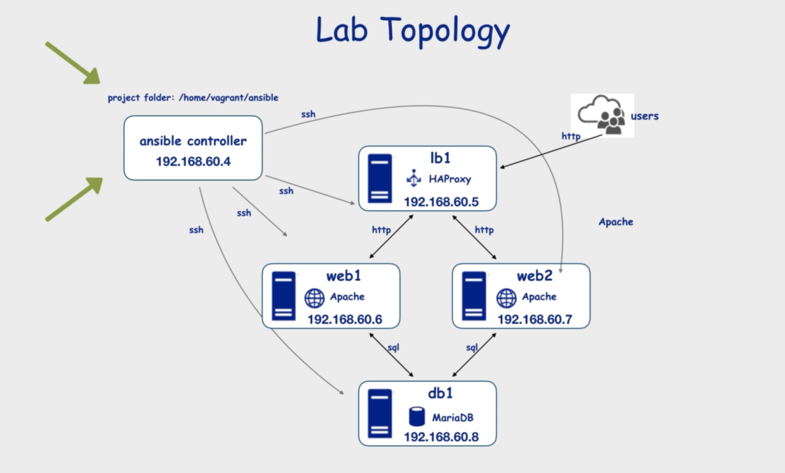

# _Ansible Essentials_ Course

Ny notes and stuff used while following the [Ansible Essentials](https://www.udemy.com/course/ansible-essentials/) course on Udemy.

Github repo that contains stuff from author is [here](https://github.com/uguroktay/ansible_essentials).

## Section 1: Introduction

Should I use docker? Is there a docker-compose setup available? Vagrant is too heavy...But creating the docker env is extra work and means adding extra challenges. OK, let's do it...[here](./docker/readme.md) is the docker setup & it's explanation.

This is the lab topology my docker network needs to provide:


## Section 2: Ansible Foundations & Installation

### Commands

- `ansible --version` also shows the settings, i.e. where the config file is located etc.
- `ansible-config --view` shows the config that is valid now.
- `ansible-config dump --only-changed`
- `ansible-config --version` also shows which cfg file is used.

The `ansible.cfg` file is in `/etc/ansible/ansible.cfg`. It points to our hosts file in `/home/ansible/hosts`.

**Note** that both directories `/etc/ansible` and `/home/ansible` of the controller docker are mounted to local directories under `controller-mountpoints`.

**Order of config file locations** is

- `ANSIBLE_CONFIG` env variable
- `ansible.cfg` in the current dir. This is what we are using, so we need to make sure we always start ansible commends from whithin `/home/ansible`
- `~/.ansible.cfg` a hidden file in the home dir
- `/etc/ansible/ansible.cfg`

## Section 3: Ansible Ad-Hoc Commands

Ansible modules are listed [here](https://docs.ansible.com/ansible/latest/modules/modules_by_category.html)(by category)

To start the docker compose network and run the ping module:

```bash
docker-compose up
exec -it controller bash
ansible all -m ping
```

### Problem: SSH Connection

The controller docker at first could not ssh into the other dockers. And this is needed, even for the Ansible ping module (as the ping module creates a SSH connection - instead of actually pinging...).

**Solution**
I replaced the CentOS docker images with a Ubuntu image, as I know more about Ubuntu. Then I created Dockerfiles for the controller and for the nodes that make sure that the SSH server and all the needed packages are installed. I also created start scripts that start the SSH server with the parameters needed (i.e. root user can login via ssh).

**Careful**, I changed the password of root users to `root` to make things easier. But it's not safe! 🤞

Next try: Follow [this guide](https://phoenixnap.com/kb/how-to-ssh-into-docker-container), first by manually installing the SSH deamons.

Helpful commands:

- See what services are running: `service --status-all`
- Check if ssh deamon is running: `service ssh status`
- Start ssh deamon: `service ssh start`
- What Linux version am I using?: `lsb_release -a`
-
