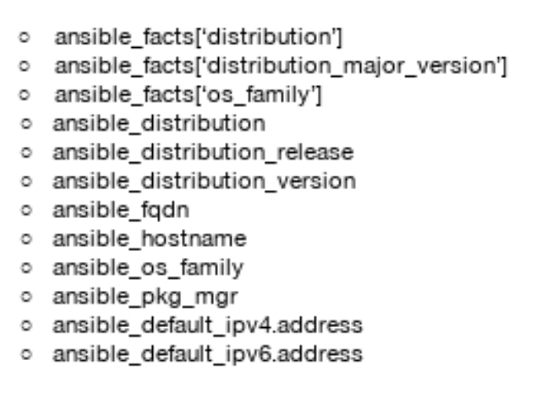
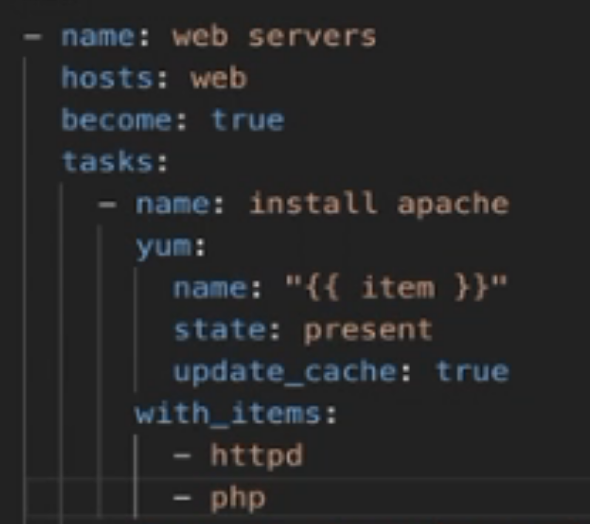
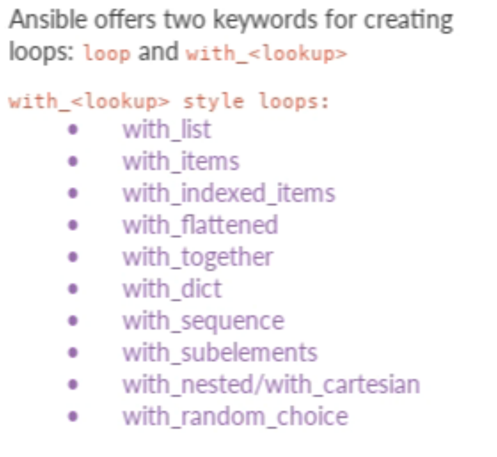
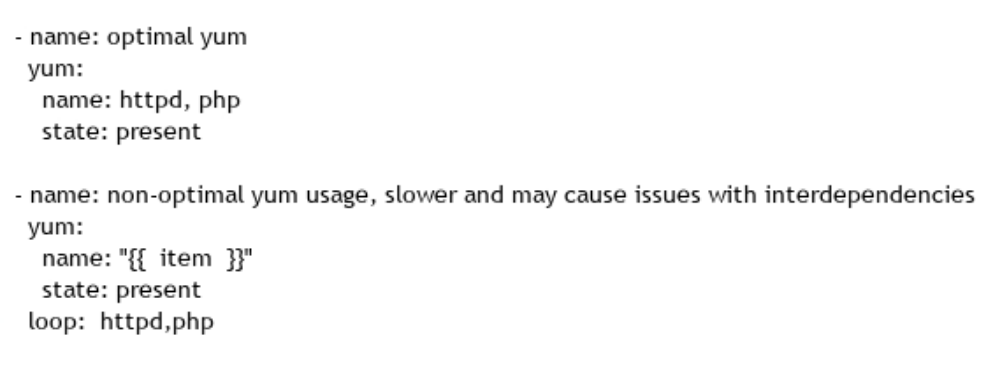
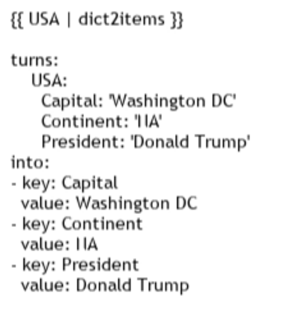
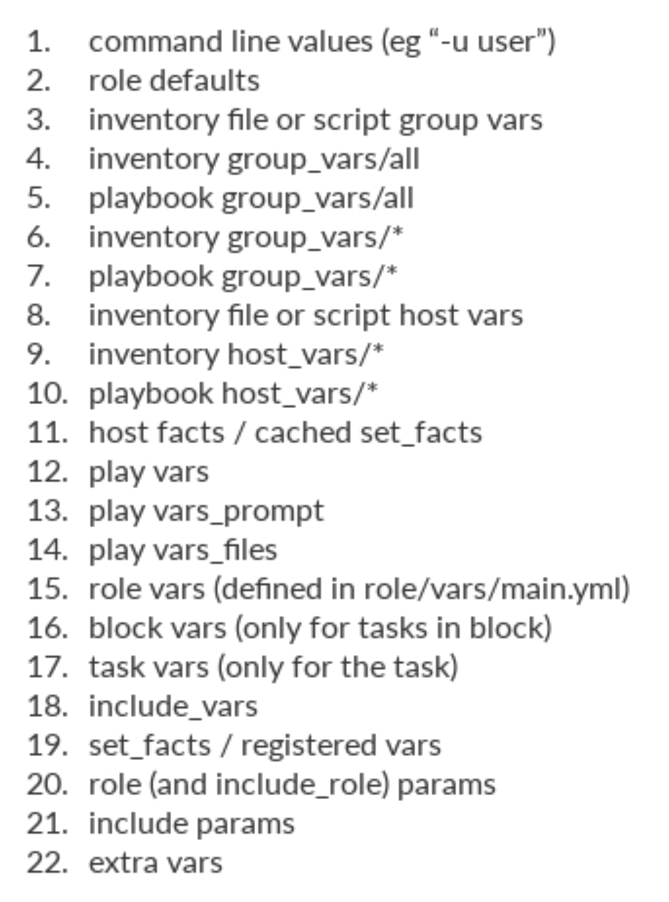

# _Ansible Essentials_ Course

Ny notes and stuff used while following the [Ansible Essentials](https://www.udemy.com/course/ansible-essentials/) course on Udemy. My setup differs a bit from the one suggested in the course as I use a docker network rather than a Vagrant one.

Github repo that contains stuff from author is [here](https://github.com/uguroktay/ansible_essentials).

## Section 1: Introduction

Should I use docker? Is there a docker-compose setup available? Vagrant is too heavy...But creating the docker env is extra work and means adding extra challenges. OK, let's do it...[here](./docker/readme.md) is the docker setup & it's explanation.

This is the lab topology my docker network needs to provide:


## Section 2: Ansible Foundations & Installation

### Commands

- `ansible --version` also shows the settings, i.e. where the config file is located etc.
- `ansible-config --view` shows the config that is valid now.
- `ansible-config dump --only-changed`
- `ansible-config --version` also shows which cfg file is used.

The `ansible.cfg` file is in `/etc/ansible/ansible.cfg`. It points to our hosts file in `/home/ansible/hosts`.

**Note** that both directories `/etc/ansible` and `/home/ansible` of the controller docker are mounted to local directories under `controller-mountpoints`.

**Order of config file locations** is

- `ANSIBLE_CONFIG` env variable
- `ansible.cfg` in the current dir. This is what we are using, so we need to make sure we always start ansible commends from whithin `/home/ansible`
- `~/.ansible.cfg` a hidden file in the home dir
- `/etc/ansible/ansible.cfg`

## Section 3: Ansible Ad-Hoc Commands

General syntax for invoking ad hoc commands:

```bash
ansible -i <inventory_file> <target_hosts> -m <module_name> -a 'arguments'
```

Ansible modules are listed [here](https://docs.ansible.com/ansible/latest/modules/modules_by_category.html)(by category). Examples are

- Installing things using `yum` or `apt`
- Starting or stopping services
- Copying files
- Doing things on AWS
- ...

To start the docker compose network and run some ad hoc commands:

```bash
cd docker
docker-compose up
docker exec -it controller bash

ansible all -m ping

ansible web2 -m command -a "uptime"
# same as this (because if no module is specified "command" is assumed):
ansible web2  -a "uptime"

# Get the name of our 2 web servers:
ansible web -a "uname -a"

# Copy the hosts file to tmp an both web servers:
ansible web -m copy -a "src=/etc/hosts dest=/temp/"

# Do the same thing for servers in our lb group and our web group (":" means "or"):
ansible lb:web -m copy -a "src=/etc/hosts dest=/temp/"

# Install the ntp package on both our web servers:
ansible web -m apt -a "name=ntp state=latest"
# ...and delete it again:
ansible web -m apt -a "name=ntp state=absent"

# See what Ubuntu versions your nodes are running (Note that we use shell instead of command):
ansible all -m shell -a "cat /etc/*release"

# Get lots of informatoion about your web1 server:
ansible web1 -m setup

# How much memory do my machines have?:
ansible all  -m setup -a "filter=ansible_memtotal_mb"
```

## Section 4: Ansible Playbooks

### YAML

- Good practice: Use 2 spaces for indentation, don't use tabs.
- I use the YAML VScode extension (YAML Language Support by Red Hat)

### Tasks

- Tasks are tasks that are performed by Ansible 😂
- We describe tasks by _the state that should be achieved after execution_.
- In the course they mention a lot the `yum` module to install packages. Since I don't use CentOS but Ubuntu, I need to use `apt` instead. But it seems smart to use the more abstract `package` module that is available since Ansible 2. For an example see (here)[https://serverfault.com/questions/587727/how-to-unify-package-installation-tasks-in-ansible].

### Playbooks

- Playbooks are made out of plays - duuuh...

To start the docker compose network and run some ad hoc commands:

```bash
cd docker
docker-compose up
docker exec -it controller bash

# Go to the dir where we have the playbook
cd /home/ansible/

# Check the syntax of the playbook
ansible-playbook playbook1.yml --syntax-check

# Do a dry run
ansible-playbook playbook1.yml --check

# If you want to read more details
ansible-playbook playbook1.yml --check -v#

#...even mnore details:
 ansible-playbook playbook1.yml -C -vv

 # Run it for real:
 ansible-playbook playbook1.yml

# Run it and see all the SSH communication:
ansible-playbook playbook1.yml -vvv
```

### Setup module / Host facts

There is a `setup` module that gathers facts about hosts. That's what ansible runs at tghe beginning of the playbooks.

Some examples:

```bash
ansible web1 -m setup -a "filter=ansible_os_family"

#Result would be (in our case, running on Ubuntu)
web1 | SUCCESS => {
    "ansible_facts": {
        "ansible_os_family": "Debian"
    },
    "changed": false
}
```

Some intersting variables provided by the setup module:



The setup module is pre-pended to every playbook by default. It's reported as _Gathering facts_. As gathering facts might take quite some time, you can disable it for a playbook like so:

```yaml
- hosts: all
  gather_facts: false
  tasks:
     - name: ...
```

### Package module 

In the course they use the `yum` module, but since we are on a Debian based environment...

The docume ntation of the package module [is here](https://docs.ansible.com/ansible/latest/modules/package_module.html). Note: It seems way easier than the yum module 😂

Run the stuff:

```bash
cd docker
docker-compose up &
docker exec -it controller bash

cd /home/ansible

# Check our playbook
ansible-playbook web.yml --syntax-check

# Run it
ansible-playbook web.yml 
```

### Service Module

The service module is used to start, stop services.

```bash
# Get help about ansible modules on the command line:
# ansible-doc <module>
ansible-doc service
```

Check if the web server runs by pointing your browser to it: On your host machine, got to [http://localhost:1011/](http://localhost:1011/)

### Loops

A sample loop:

```yaml
- name: Copy using inline data
    copy:
    src: "{{ item }}"
    dest: /var/www/html/
    owner: root
    group: root
    mode: 0644
    backup: yes
    loop:
    - files/index.html
    - files/index.php
```

Alternative use `with_<lookup>` like so:



Possible `with_<something>` loops are:



The recommended way to install multiple packages (and other ways are often suggested when searching Google):


 
 **Note:** I still used the `loop` construction, since I used the `package` module (that doesn't allow to list multiple packages)

 Check if copying the php file, ionstalling & restarting all the services worked by checking [the web server on web2](http://localhost:1012/index.php)

 ### Variables

* Variables alwas start with a letter
* Variables conatin letters, numbers, underscores
* What doesn't work are dashes, dots...

The `debug` module is great for checking variables:

```YAML
- name: Output variable hello
  debug:
    msg: "{{ hello }}"
```

Variables can also be **lists**:

```YAML
vars:
  countries: [Korea, China, Russia, India]

# or:

vars:
  countries:
  - Korea
  - China
  - Russia
  - India
```
Variables can also be **dictionaries**:

```YAML
- hosts: web1
  vars:
    USA: { Capital: 'Washington DC', Continent: 'NA',President: 'Donald Trump' }
  tasks:
  - name: Ansible Dictionary output items
    debug:
      msg: "{{ USA.President }} is equivalent to  {{ USA['President'] }}"
    loop: "{{ USA|dict2items }}"```
  - name: Ansible Dictionary dict2Item
    debug:
      msg: "Key is {{ item.key }} value is {{ item.value}}"
    loop: "{{ USA|dict2items }}"
```

This is what is actually happening here:



There are many different places where you can declare variables (sorted by precedence):



* In a playbook in a `vars:` section
* In a playbook as external variables file:

```YAML
- hosts: web1
  vars_files:
  - /vars/eternal_vars.yml
  tasks:
  ...

# vars/external_vars.yml
somewhar: somevalue
password: magic
```

* In a file per host:

```YAML
- hosts: all
  include_vars: "{{ ansible_hostname }}.yml"
  tasks:
```

* Thru a user prompt:

```YAML
- hosts: web
  gather_facts: false
  vars_prompt:
  - name: "version"
    prompt: "Which version do you want to install?"
  tasks:
  - name: Ansible prompt example.
    debug:
      msg: "will install httpd-{{ version }}"
  - name: install specific apache version
    yum: 
      name: "httpd-{{ version }}"
      state: present 
```

* Inventory variables:
  * Defined in the inventory file
  * Files located under `group_vars` and `host_vars` folder. 
  * Each file should be named after the host or group it belongs to.
  * Define site wide defaults inside `group_vars/all` file.
  * If the `group_vars` and `host_vars`folders are located in the same folder as the inventory (`hsosts`file), they apply also to ad hoc commands. Place the in the same directory as playbooks to make them available to playbooks only.

```YAML
# File group_vars/web
vhost_config_file: /etc/httpd/conf.d/ansible.conf
apache_config_file: /etc/httpd/conf/httpd.conf
document_root_path: /var/www/ansible/
repository: https://github.com/uguroktay/ansible_essentials.git
check_interval: 1
```

```YAML
# file: ansible/group_vars/all
# This is the site wide default
ntp_server: default-time.example.com
apache_port: 80
```
```YAML
# file: ansible/group_vars/europe
# This is the default for the group named europe
ntp_server: europe-time.example.com
apache_port: 8080
```
```YAML
# file: ansible/host_vars/web1
# This is the default for host web1
ntp_server: bucharest.example.com
apache_port: 80
```

* Set variables on the command line

```bash
# Launch a ansible playbook like so:
ansible-playbook extravars.yml --extra-vars "my_message='extra vars are powerful' other_var='something else'"
```

### Variables precendence

**Rule**: Avoid defining the same variable at different places!

Ansible has 3 main scopes:
* Global: This is set by config, environment variables and the command line
* Play
* Host

### Lineinfile module

* This module ensures a particular line is in a file, or replace an existing line using a back-referenced regular expression.
* This is primarily useful when you want to change a single line in a file only.
* See the [docs with valuable examples](https://docs.ansible.com/ansible/latest/modules/lineinfile_module.html).


**Target**: Have a playbook that updates /etc/hosts file

```YAML
---
- name: common tasks
  hosts: all
  become: true
  tasks:
    - name: update/etc/hosts file
      lineinfile:
        path: "{{ hostsfile }}"
        regexp: "{{ item }}$"
        line: "{{ hostvars[item].ansible_facts.eth1.ipv4.address }} {{ hostvars[item].ansible_facts.hostname }}.{{ domainname }} {{ hostvars[item].ansible_facts.hostname }}"
      loop: "{{ groups['all'] }}"
```
```YAML
# file: group_vars/all
domainname: "testdomain.com"
hostsfile: "/etc/hosts"
```

### Handlers

Handlers are just like regular tasks in an Ansible playbook (see Tasks) but are only run if the Task contains a notify directive and also indicates that it changed something.

In our sample playbook we restart the appache service no matter what happened before. If we run the playbook twice, the second time the apache server is restarted - even though no changes were introduced and we wouldn't need to restart it. Therefore our playbook is not idempotent, and we want them to be.

Handlers to the rescue: A tasks might `notify` a handler when (and only when) something was changed. 

In our sample:

```YAML

    - name: Copy vhost config
      copy:
        src: files/ansible_site.conf
        dest: "{{ vhost_config_file }}"
        owner: root
        group: root
        mode: 0644
      notify: restart apache # !!

  handlers:
    - name: restart apache
      service:
        name: httpd
        state: restarted
```

#### Summary

* Handlers are like other regular tasks but they only execute when notified by a change.
* Handlers are referenced by their name that must  be globally unique
* Regardless of how many tasks notify a handler, it will only run once after all the tasks complete in a particular play
* A task can call multiple handlers

### Error Handling

* When a task fails on a remote machine, processing stops fo that host in Ansible.

A sample on how to check if the Apache configuration file is valid: In order to check the config file on the host running the httpd service you would run `httpd -t`. So the Ansible task that checks it would look like this:

```YAML
    - name: Check configuration file
      command: httpd -t
```

If this task fails, Ansible stops the execution right there. But: the configuration file is broken already, so subsequent httpd starts would fail.

In order to deal with errors, we need to store the result in a variable. That's done with `register`:

```YAML
    - name: Check configuration file
      command: httpd -t
      register: result
```

Now we can react to the value of `result`:

```YAML
    - name: Informing user and ending playbook
      fail: 
        msg: "Config file was not invalid. Aborting"
      when: result is failed
```
Note that `fail` has the same function as `debug` and then stops the executioon of the playbook.

Ther's a catch thow: When the `httpd -t` command fails, the playbook execution is aborted, so it doesn't even get to the `fail` module. To remedy this, there is the `ignore_errors` options:

```YAML
    - name: Check configuration file
      command: httpd -t
      register: result
      ignore_error: yes
    - name: Informing user and ending playbook
      fail: 
        msg: "Config file was not invalid. Aborting"
      when: result is failed
```

### Blocks

Most of what you can apply to a single task (with the exception of loops) can be applied at the Blocks level, which also makes it much easier to set data or directives common to the tasks. 

```YAML
tasks:
  - name: Install,configure and start apache
    block:
    - name: install bar and foo
      yum:
        name: bar, foo
        state: present
    - name: apply config for foo
      template: 
        src: teamplates/src.j2
        dest: /etc/foo.conf
    - name: start bar
      service:
        name: bar
        state: started
        enabled: true
    when: ansible_facts['distribution']  == 'CentOS'
    become: true
    become_user: root
    ignore_errors: yes
```

Blocks also introduce the ability to handle errors in a way similar to exceptions in most programming languages. Blocks only deal with *failed* status of a task. A bad task definition or an unreachable host are not *rescuable* errors:

```YAML
tasks:
- name: Handle the error
  block:
    - debug:
        msg: 'I execute normally'
    - name: i force a failure
      command: /bin/false
    - debug:
        msg: 'I never execute, due to the above task failing, :-('
  rescue:
    - debug:
        msg: 'I caught an error, can do stuff here to fix it, :-)'
```
This will *revert* the failed status of the outer `block` task for the run and the play will continue as if it had succeeded.

#### Always and Rescue Sections

The rescue section comes in very hadny as well: It executes only when a task ion the bvlock fails.

```YAML
tasks:
- name: Handle the error
  block:
    - debug:
        msg: 'I execute normally'
    - name: i force a failure
      command: /bin/false
    - debug:
        msg: 'I never execute, due to the above task failing, :-('
  rescue:
    - debug:
        msg: 'I caught an error, can do stuff here to fix it, :-)'
```

There is also an always section, that will run no matter what the task status is.

```YAML
- name: Always do X
   block:
     - debug:
         msg: 'I execute normally'
     - name: i force a failure
       command: /bin/false
     - debug:
         msg: 'I never execute :-('
   always:
     - debug:
         msg: "This always executes, :-)"
```
With this tooling, some details about what runs when:

* The tasks in the block are getting executed.
* If one task of the block fails, the remaining tasks are not executed anymnore, and execution of the rescue tasks starts.
* If the tasks within the rescue mission run through smoothly, the entire block is considered as having executed succesfully- Therefore the playbook exceution continues.
* If a task in the rescue block fail, the entire block is considered as failed, i.e. playbook execution is stopped.
* Always block is always executed, no matter wether block or rescue tasks failed or not.

A sample with all the features (block, rescue, handlers...) can be visited in the [final version of the web.yml](https://github.com/uguroktay/ansible_essentials/blob/master/course_contents/web.yml)

### Git module

The git module manages git checkouts of repositories to deploy files or software. 

Some notes:

* It requires the git package to be installed
* When checking out from a git repo, it expects an **empty** detination directory!

```YAML
 - name: deploy index.php
      git:
        repo: "{{ repository }}"
        dest: "{{ document_root_path }}"
```

### Templating

A template is a text document where some or all of the content is dynamically generated. Templates are rendered using [Jinja2](https://jinja.palletsprojects.com/en/2.11.x/) and [enhances them](https://docs.ansible.com/ansible/latest/user_guide/playbooks_filters.html).

With templates we can do

* Variable substitution
* Conditional statements
* Loops
* Filters for transforming data
* Arithmetic calculations

#### Variable replacement

```YAML
# file: template1.yml

- hosts: controller
  become: yes
  vars:
    var1: 'Hello Africa'
    var2: 'Hello Asia'
  tasks:
  - name: Ansible Template Example
    template:
      src: template1.j2
      dest: /tmp/output.txt
```
```text
file: template1.j2

{{ var1 }}
Just a static line
this line includes an inline variable - {{ var2 }} - :)
```

Some of the possible template module parameters (similar to `copy` module):

* mode
* group
* force
* backup

Templating happens on the controller, not on the hosts!

#### For loops

```YAML
# File: template2.yml

- hosts: controller
  vars:
    mylist: ['Peach','Plum','Horse','Crocodile','Butterfly']
  tasks:
   - name: Template Loop example
     template:
       src: template2.j2
       dest: /tmp/output.txt
```

```t
# File: template2.j2

Example of looping with a list inside a template.

  {{ item }}
 #Every item will be output on an extra line
# To have alle the items listed on one line use:
# {%- endfor }
```

#### if, elif, else

```YAML
- hosts: controller
  vars:
    logfile: /var/log/mylog.txt
  tasks:
  - name: Template example
    template:
      src: template4.j2
      dest: /tmp/output.txt
```

```t
# File: template4.j2

Log file has been defined!  
 
```

Logical combinations of boolean vars:

```t


 # Evals to true if the var is not defined
```

Comparing:

```t



 # Test if banana is in list fruits
```

#### Filters

Filters are functions that run on a variable and produce an output. This is part of the [Jinja2 mechanisms](https://jinja.palletsprojects.com/en/2.11.x/templates/#filters). Therefore [all Jinja2 filters](https://jinja.palletsprojects.com/en/2.11.x/templates/#builtin-filters) can be used.

Examples: 

* `{{ myvariable | int }}` transforms the variable `myvariable` in an Integer using the `int` filter.
* `{{ list1 | union(list2) }}`
* You can also chain filters: `{{ mystring|capitalize|reverse }}`


Typical use of filters:

* Format data: `{{ some_variable | to_json }}`. This can be helpful for debugging. Also `to_yaml` `from_json`, `from_yaml`.
* Manipulöate IP addresses: `{{ myvar | ipaddr }}`, `{{ myvar | ipv4 }}`, `{{ myvar | ipv6 }}`, `{{ '192.0.2.1/24' | ipaddr('address') }}`.
* Regular expression matching: 

```t
# Search for "foo" in "foobar"
{{ 'foobar' | regex_search('(foo)')}}

# Convert "localhost:80" to "localhost"
{{ 'localhost:80' | regex_replace(':80') }}
```

* Manipulate lists: `{{ list1 | min }}`, `{{ [3, 4, 2] | max }}`, `{{ list1 | intersect(list2) }}`
* Defaulting variables: `{{ some_variable | default(5) }}`

#### Tests

Jinja2 tests evaluate tempalte expressions and return `True` or `False`.

* `result is failed`
* `variable2 is defined`

Those tests can be used in the `when` section of tasks:

```YAML
- debug:
  msg: "it failed"
  when: result is failed
- debug:
  msg: "it changed"
  when: result is changed
- debug:
  msg: "it succeeded"
  when: result is succeeded 
- debug:
  msg: "it was skipped"
  when: result is skipped
```

You can also use text matching or regex by using tests.

Tests are used for comparisons whereas filters are used for data manipulation.

### Templating the HAProxy Config

In this setup, [HAProxy](http://www.haproxy.org) is used as Loadbalancer. HAProxy is an Open Source Load Balancer.


To Configure HAProxy so it distributes the requests to the 2 web servers, this is a part of the config file we need to provide:

```
defaults
    mode                    http
    timeout http-request    10s
    timeout queue           1m
    timeout connect         5000
    timeout client          50000
    timeout server          50000
    timeout http-keep-alive 10s
    timeout check           10s
    maxconn                 150

frontend  main
    bind *:80
    default_backend servers
backend servers
    balance     roundrobin
    server web1 192.168.60.6:80 weight 10 check port 80
    server web2 192.168.60.7:80 weight 10 check port 80
    option httpchk HEAD /index.php HTTP/1.0
```

The upper part of this configuration is static. The server section with the IP addresses of the web servers can be designed in a Jinja2 template like so:

```
backend servers
    balance     roundrobin

    server {{ hostvars[item].ansible_facts.hostname }} {{ hostvars[item].ansible_facts.eth1.ipv4.address }}:80 weight 10 check port 80

    option httpchk HEAD /index.php HTTP/1.0
```

The playbook that ships the `haproxy.cfg` file to the proper location can be inspected [here](https://github.com/uguroktay/ansible_essentials/blob/master/course_contents/lb.yml).

Note one interesting detail: There is an additional play at the beginning of the playbook that exists only so the facts for the web server nodes are gathered:

```YAML
- name: gather facts for web group
  hosts: web
  gather_facts: true
```

### Mysql & mysql user

Created a `db.yml` file, as in the tutorial with little modificataions:

* Skip the `become: true` statement as we don't need it on our Ubuntu nodes.
* Use `package` module instead of `yum`.
* Changed the package names that are to be installed. I had to search a bit and found the right way for a Ubuntu host [here](http://www.youdidwhatwithtsql.com/simple-mariadb-deployment-ansible/2311/)
  
### Common tasks

We created a playbook for every server category we are dealing with: `web.yml`, `lb.yml`, `db.yml`. For tasks that are needed for all server categories we create an extra file called `common.yml`. This would hold tasks like installing ntp services, firewall, etc.

The `common.yml` file has the following structure:

```Yaml
---
- name: common tasks
  hosts: all
  become: true
  tasks:
    # We skip this one in our Docker setup
    - name: update/etc/hosts file 

    # Installs firewalld and ntp with a loop
    - name: install common pckages
  
    - name: configure ntp

    # Starts ntpd and fireqwalld with a loop
    - name: start and enable service

    # Open port SSH_port in firewalld for ansibnle
    # We don't need this in our setup - don't ask me why...
    - name: allow SSH traffic

    # We skip this one as we use Ubuntu
    - name: disable selinux

handlers:
    - name: restart ntp
```

### Firewalld Module

Since we installed the `firewalld` package, now httpd is blocked. In order to open the corresponding ports we need to configure the firewall.

