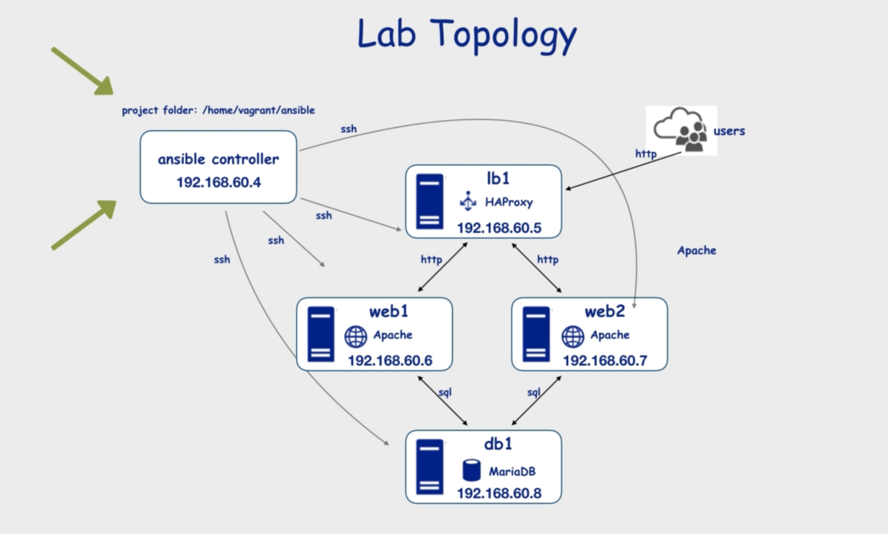

# Docker setup for *Ansible Essential* Udemy Course

## Getting started

In order to start the local docker network follow these steps:

```bash
git clone git@github.com:tillg/ansible-essentials-course.git
cd ansible-essentials-course/docker
docker-compose up --build &
```

Now your local network of nodes is running:


To connect to the controller via a terminal:

```bash
docker exec -it controller bash
```
### Accessing nodes

The different nodes of the docker-setup network run _inside_ the docker network. To get access to them, I exposed ports like so:

* lb expoises it's port 80 to 1001
* web1 resp. web2 expose their port 80 to 1011 resp. 1012

So to see what web2 serves, point your browser to [http://localhost:1012/](http://localhost:1012/)

## Problems & Solutions

* When launching the docker network **the containers start and stop immediatly**. It turns out, that to keep them running we just have to add a command that keeps them _busy_: `command: tail -F anything` Found the solution [here](https://stackoverflow.com/questions/38546755/docker-compose-keep-container-running/45450456).